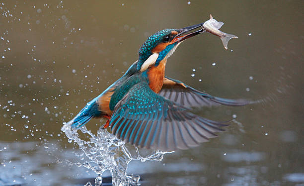
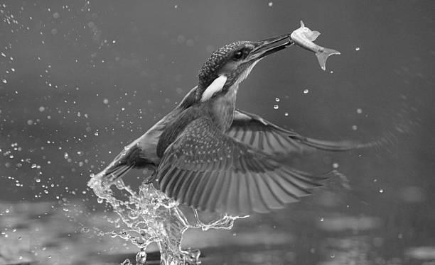
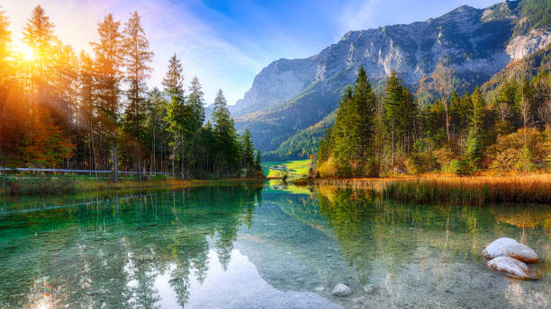
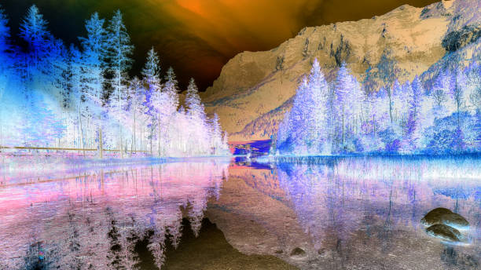
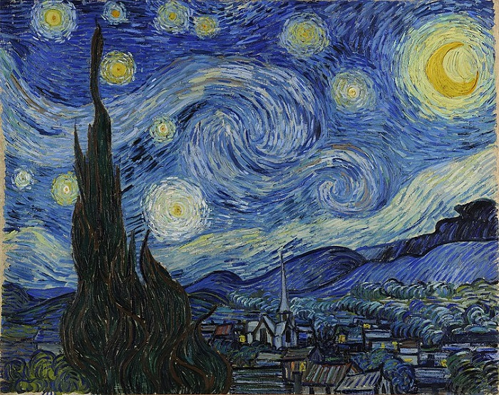
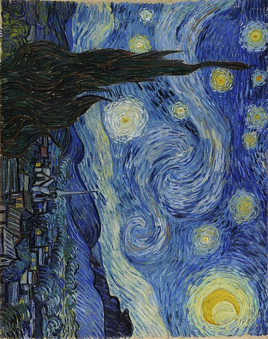

## DAI 2025–2026 - Class C - Practical Work 1

---

## Table of Contents
- [Authors](#authors)
- [Project Overview](#project-overview)
- [Implemented Commands](#implemented-commands)
- [Build Instructions](#build-instructions)
- [Usage Examples](#usage-instructions)
- [Example Results](#example-results)
- [Use of AI Tools](#use-of-ai-tools-and-external-sources)

---

### Authors
- **Romain Durussel**
- **Abram Zweifel**

HEIG-VD, Class C, 2025–2026

---

### Project Overview

In this project, we developed a command-line tool to perform various image processing operations.
The tool allows users to easily apply transformations to RGB images directly from the terminal.

The purpose of this tool is to make basic image transformations accessible directly from the 
command line without needing complex image editing software. It supports multiple formats and 
demonstrates practical use of Java I/O and image processing libraries.

---

### Implemented Commands

1. ```grayscale```: converts an RGB color image to grayscale. 


2. ```invert``` program : inverts the colors of an RGB image.


3. ```rotate``` program : rotates the image by 90°, 180°, or 270° (clockwise).

---

### Build Instructions

Follow these commands to clone and build the project locally:

1. Clone the repository from GitHub :
```bash
git clone https://github.com/Abram0303/DAI-2025-2026-Class-C-Practical-work-1-Romain-Durussel-Abram-Zweifel.git
```

2. Navigate to the project directory :
``` bash
cd DAI-2025-2026-Class-C-Practical-work-1-Romain-Durussel-Abram-Zweifel
```


3. Build the project using Maven :
``` bash
./mvnw clean package
```

After this step, the generated JAR file will be located in the target/ directory :
``` target/ImageProcessor-1.0-SNAPSHOT.jar ```

---

### Usage Instructions

1. Open a terminal and navigate to the project directory.


2. Run the desired command with the appropriate arguments. Here are some examples (with inputs at your disposal in the image/input/ folder) :
   - Grayscale conversion:
   ``` bash
   java -jar target/ImageProcessor-1.0-SNAPSHOT.jar -i image/input/input1.jpg -o image/output/output1_grayscale.jpg grayscale
   ```
   - Color inversion:
   ``` bash
   java -jar target/ImageProcessor-1.0-SNAPSHOT.jar -i image/input/input1.jpg -o image/output/output1_invert.jpg invert
   ```
   - Image rotation:
   ``` bash
   java -jar target/ImageProcessor-1.0-SNAPSHOT.jar -i image/input/input1.jpg -o image/output/output1_rotate.jpg rotate -a 90
   ```
   - Help command:
   ``` bash
   java -jar target/ImageProcessor-1.0-SNAPSHOT.jar help
   ```
   - Version command:
   ``` bash
   java -jar target/ImageProcessor-1.0-SNAPSHOT.jar version
   ```

3. **From IntelliJ IDEA**
    - Open the project in IntelliJ.
    - Use the *Run ImageProcessor* configuration to launch the CLI.
    - Use the *Package JAR* configuration to build the executable JAR. 
      - Once the build is complete, you can run the CLI directly:
        ```java -jar target/ImageProcessor-1.0-SNAPSHOT.jar -h```

---

### Example Results

The following examples show the transformations applied to sample images available in the `image/input/` folder.

| Command | Input                             | Output                                         |
|----------|-----------------------------------|------------------------------------------------|
| `grayscale` |  |  |
| `invert` |  |     |
| `rotate -a 90` |  |     |

---

### Use of AI Tools and External Sources

We used ChatGPT as an inspiration and support tool during the development of this project.
ChatGPT suggested the use of the Java classes ```BufferedImage``` and ```Raster``` for direct pixel-level image manipulation.

We decided to follow this approach because these classes are part of the Java standard image processing API and are specifically designed to handle pixel data.

- ```BufferedImage``` provides a convenient object representation of an image in memory, allowing access to its pixels and color model.

- ```Raster``` and ```WritableRaster``` allow direct reading and modification of pixel values (R, G, B), which is ideal for operations such as grayscale conversion or color inversion.

By contrast, classes like ```BufferedInputStream``` and ```BufferedOutputStream``` only handle raw binary streams (sequences of bytes).
They are useful for reading or writing files efficiently, but they do not interpret or manipulate image pixels.
Using them would require manually parsing the image format (e.g., BMP, PNG, JPG).

